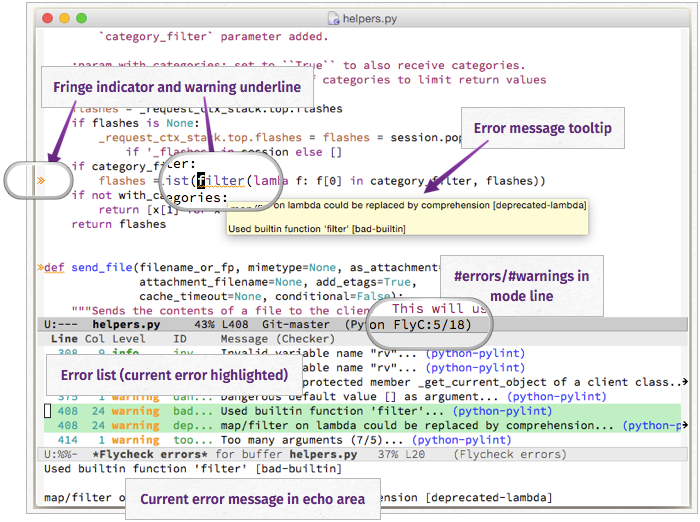

==========================================
 Flycheck — Syntax checking for GNU Emacs
==========================================

**Flycheck** is a modern on-the-fly syntax checking extension for GNU Emacs,
intended as replacement for the older Flymake extension which is part of GNU
Emacs.  For a detailed comparison to Flymake see :ref:`flycheck-versus-flymake`.

It uses various syntax checking and linting tools to :ref:`automatically check
the contents of buffers <flycheck-syntax-checks>` while you type, and reports
warnings and errors directly in the buffer, or in an optional :ref:`error list
<flycheck-error-list>`:

Out of the box Flycheck supports over :ref:`40 different programming languages
<flycheck-languages>` with more than 80 different syntax checking tools, and
comes with a :ref:`simple interface <flycheck-developers-guide>` to define new
syntax checkers.

Many :ref:`3rd party extensions <flycheck-extensions>` provide new syntax
checkers and other features like alternative error displays or mode line
indicators.

Try out
=======

Flycheck needs GNU Emacs |min-emacs| or newer, and works best on Unix systems.
**Windows users**, please be aware that Flycheck does not support Windows
officially, although it should mostly work fine on Windows.  See :ref:`Windows
support <flycheck-windows-support>` and watch out for `known Windows issues`_!

To try Flycheck in your Emacs session install some :ref:`syntax checker tools
<flycheck-languages>` and type the following in your ``*scratch*`` buffer and
run ``M-x eval-buffer``:

.. code-block:: cl

   (require 'package)
   (add-to-list 'package-archives
                '("MELPA Stable" . "http://stable.melpa.org/packages/") t)
   (package-initialize)
   (package-refresh-contents)

   (package-install 'flycheck)

   (global-flycheck-mode)

*On MacOS* also add the following to :ref:`fix your $PATH environment variable
<flycheck-macos-exec-path-from-shell>`:

.. code-block:: cl

   (package-install 'exec-path-from-shell)
   (exec-path-from-shell-initialize)

For a permanent installation of Flycheck follow the :ref:`Installation
<flycheck-installation>` instructions.  For a gentle introduction into Flycheck
features go through :ref:`Quickstart <flycheck-quickstart>` guide.

.. important::

   If Flycheck fails to run properly or gives you any error messages please take
   a look at the :ref:`troubleshooting section <flycheck-troubleshooting>` which
   covers some common setup issues and helps you debug and fix problems with
   Flycheck.

.. _`known windows issues`: https://github.com/flycheck/flycheck/labels/B-Windows%20only

.. _flycheck-user-guide:

The User Guide
==============

The User Guide provides installation and usage help for Flycheck.  It starts
with installation instructions and a quick start tutorial and then focuses on an
in-depth references of all parts of Flycheck.

.. toctree::

   user/installation
   user/quickstart
   user/troubleshooting
   user/syntax-checks
   user/syntax-checkers
   user/error-reports
   user/error-list
   user/error-interaction
   user/flycheck-versus-flymake

.. _flycheck-community-guide:

The Community Guide
===================

The Community Guide provides information about Flycheck’s ecosystem and
community.

.. toctree::

   community/conduct
   community/extensions
   community/get-help
   community/people

.. _flycheck-developer-guide:

The Developer Guide
===================

The Developer Guide shows how extend Flycheck and how to write syntax checkers
for Flycheck.

.. toctree::

   developer/developing

.. _flycheck-contributor-guide:

The Contributor Guide
=====================

The Contributor Guide explains how to contribute to Flycheck.

.. toctree::

   contributor/contributing
   contributor/style-guide
   contributor/maintaining

Indices and Tables
==================

* :ref:`flycheck-languages`
* :doc:`glossary`
* :doc:`changes`
* :ref:`genindex`
* :ref:`search`

.. toctree::
   :hidden:

   languages
   glossary
   changes

Licensing
=========

Flycheck is free software; you can redistribute it and/or modify it under the
terms of the GNU General Public License as published by the Free Software
Foundation, either version 3 of the License, or (at your option) any later
version.

Flycheck is distributed in the hope that it will be useful, but WITHOUT ANY
WARRANTY; without even the implied warranty of MERCHANTABILITY or FITNESS FOR A
PARTICULAR PURPOSE. See the GNU General Public License for more details.

See :ref:`flycheck-gpl` for a copy of the GNU General Public License.

You may copy, distribute and/or modify the Flycheck documentation under the
terms of the Creative Commons Attribution-ShareAlike 4.0 International Public
License.  See :ref:`flycheck-cc-by-sa` for a copy of the license.

Permission is granted to copy, distribute and/or modify the Flycheck logo under
the terms of the Creative Commons Attribution-ShareAlike 4.0 International
Public License.  See :ref:`flycheck-cc-by-sa` for a copy of the license.

.. toctree::
   :hidden:
   :maxdepth: 2

   licenses
