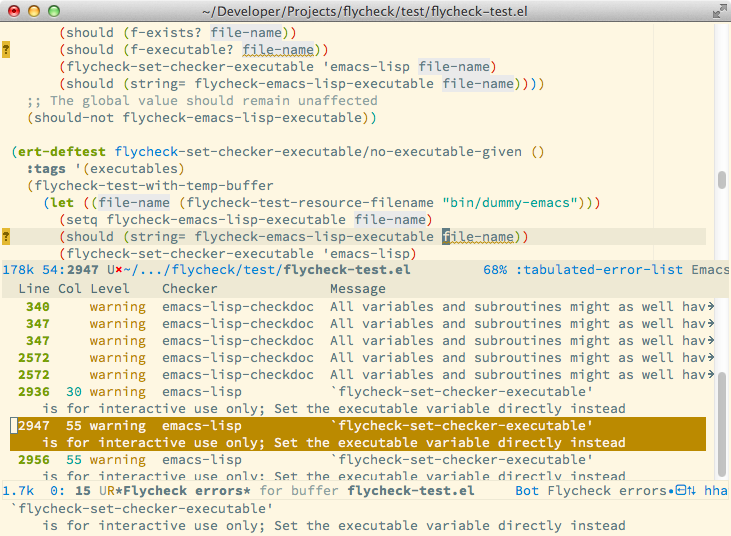

=========================================
 Flycheck — Modern Emacs syntax checking
=========================================

   Flycheck with the `Solarized Light`_ theme and the `Source Code Pro`_ font

.. _Solarized Light: https://github.com/bbatsov/solarized-emacs
.. _Source Code Pro: https://github.com/adobe/source-code-pro

Features
========

Flycheck is a modern on-the-fly syntax checking extension for GNU Emacs 24.

- :doc:`Support for over 30 languages <manual/checkers>`
- :ref:`Fully automatic syntax checking in the background <syntax-checking>`
- :ref:`Nice error indication and highlighting <error-reporting>`
- Optional error list popup
- :ref:`Many customization options <syntax-checker-configuration>`
- :doc:`A comprehensive manual <manual/index>`
- :ref:`A dead simple API to create new syntax checkers
  <defining-new-syntax-checkers>`
- A “doesn't get in your way” guarantee

Documentation
=============

.. toctree::

   manual/index

Licensing
=========

Flycheck is free software: you can redistribute it and/or modify it under the
terms of the GNU General Public License as published by the Free Software
Foundation, either version 3 of the License, or (at your option) any later
version.

Flycheck is distributed in the hope that it will be useful, but WITHOUT ANY
WARRANTY; without even the implied warranty of MERCHANTABILITY or FITNESS FOR A
PARTICULAR PURPOSE.  See the GNU General Public License for more details.

See :doc:`copying` or http://www.gnu.org/licenses/ for a copy of the GNU General
Public License.

This manual is free documentation: you can copy, distribute and/or modify it
under the terms of the GNU Free Documentation License, Version 1.3 or any later
version published by the Free Software Foundation; with no Invariant Sections,
no Front-Cover Texts, and no Back-Cover Texts.  A copy of the license is
included in the section :doc:`manual/fdl`.

Alternatively, you may copy, distribute and/or modify this manual under the
terms of the Creative Commons Attribution-ShareAlike 4.0 International Public
License.  A copy of the license can be obtained at
https://creativecommons.org/licenses/by-sa/4.0/legalcode.

.. toctree::
   :hidden:

   copying
